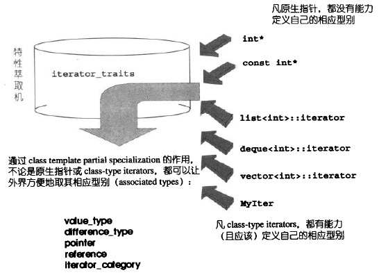
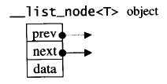
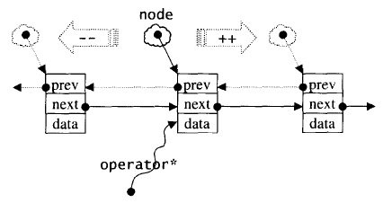
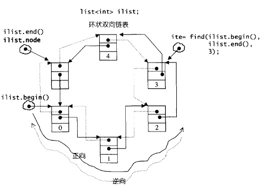
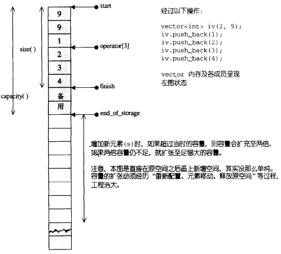

# CCSTL
轻量级stl

学习STL时根据C++标准, 参考GCC2.9标准实现

在C++标准中, STL被组织为以下13个头文件:

\<algorithm\>、\<deque\>、\<functional\>、\<iterator\>、\<array\>、\<vector\>、\<list\>、\<forward_list\>、\<map\>、\<unordered_map\>、\<memory\>、\<numeric\>、\<queue\>、\<set\>、\<unordered_set\>、\<stack\>和\<utility\>

最重要的2个是**容器**与**算法**

* **容器**(Containers)
* **分配器**(Allocators)
* **算法**(Algorithms)
* **迭代器**(Iterators)
* **适配器**(Adapters)
* **防函数**(Functors)

#### 迭代器(Iterators)

---

定义了5种iterators的类型

[iterator.h](./STL/iterator.h)

Iterator traits用以分离class iterators和non-class iterators

[trait.h](./STL/trait.h)

#### 容器(Containers)

---

##### list

* **节点**

* **迭代器**

list提供的是Bidirectional Iterators

**list的插入和接合操作都不会造成原有的list迭代器失效, 对于删除操作, 也只有"指向被删除元素"的那个迭代器失效, 其它迭代器不受任何影响**

* **list的数据结构**

SGI list不仅是一个双向链表, 还是一个环状双向链表. 所以它只需要一个指针, 便可完整表现整个链表

* **list操作的实现**

 [list.h](./STL/list.h) 

##### vector

* **迭代器**

vector维护的是一个连续线性空间, 所以不论其元素类型为何, 普通指针都可以作为vector的迭代器而满足所有必要条件.

vector支持随机存取, 而普通指针正有着这样的能力, 所以, vector提供的是Random Access Iterators.

**插入操作可能造成vector的3个指针重新配置, 导致原有的迭代器全部失效**

**vector操作的实现**

 [vector.h](./STL/vector.h) 

